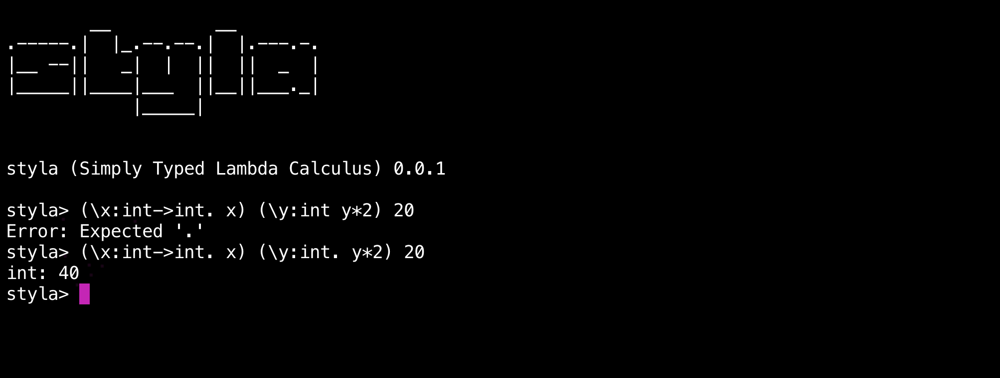

<h3> Simply Typed Lambda Calculus interpreter. </h3>

Styla is a small functional programming language/interpreter based on [simply typed lambda calculus](https://en.wikipedia.org/wiki/Simply_typed_lambda_calculus) with extensions. It is fundamentally an implementation of a type system over the original untyped lambda calculus (styla uses Church-style typing semantics i.e. it needs explicit type annotations). Styla provides three types: **`int`**, **`bool`** and **`->`**(function type) and implements static type checking, the language also supports **`if`** expressions and integer arithmetic operations such as:  **`+`**, **`-`** etc. The basic lambda abstraction is written in *Haskell* inspired syntax - 

**`(\x: int. x + 5)`**

**`(\z: bool. if z then false else true)`**

**`(\x: int->bool. x) (\y:int. false) 10`**

**`(\x:int->int. x 10)(\x:int. x)`** etc.

Lambda application is done by writing the parameters next to the lambda abstraction which should be covered in parens for disambiguation (application inside the lambda body parens are not needed but, for delineating lambda body from parameters outside parens are needed) -

**`(\x: int. x + 5) 10`**

**`(\y: bool. \z: bool. y) true false`** 

**`(\a: int->int. a 10 * 3)(\b:int. b - 3)`** 

**`(\y:bool. if y then (\x: int. x + 5) 10 else 20)`** etc. 

`Note`: Application is left associative and has the highest precedence so this is **`(\y: bool. \z: bool. y) true false`** is interpreted as follows **`(((\y: bool. \z: bool. y) true) false)`**. 

The interpreter implements all the relevant application evaluation strategies i.e. 
1. [**`call by value`**](https://en.wikipedia.org/wiki/Evaluation_strategy#Call_by_value) (This is the approach adopted by most languages) 
2. [**`call by name`**](https://en.wikipedia.org/wiki/Evaluation_strategy#Call_by_name) (a lazy/non-strict approach)  
3. [**`call by need`**](https://en.wikipedia.org/wiki/Evaluation_strategy#Call_by_need) (a more optimized lazy/non-strict approach then `call by name`)

More on how to change the evaluatation strategy type `help` in **REPL**.

Styla, because the [stlc](https://en.wikipedia.org/wiki/Simply_typed_lambda_calculus) is strongly normalizing it cannot encode recursion within the calculus i.e. fix point combinators(Y combinator etc) and therefore is a decidable problem, it always halts and normalizes to a value. The language is not [turing complete](https://en.wikipedia.org/wiki/Turing_completeness) because for being turing complete it has to be capable of simulating the [universal turing machine](https://en.wikipedia.org/wiki/Universal_Turing_machine) for which the halting problem is undecidable. Some of the church encodings are still expressible in the language and you can try them out as exercises, for reference you can use this [repo](https://github.com/archanpatkar/ChurchEncodings) in this repo I've implemented the encodings in Python which you can translate to Styla.

`P.S.`: Styla can also be transpiled to Javascript. 

## Install
Clone the repo and `cd` into the repo folder and then execute -
#### `npm install -g`
After it successfully installs then type(to open the **REPL**) -
#### `styla`

## REPL

