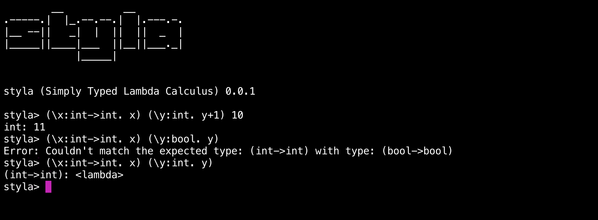

<h3> Simply Typed Lambda Calculus interpreter. </h3>

Styla is a small programming language/interpreter based on [simply typed lambda calculus](https://en.wikipedia.org/wiki/Simply_typed_lambda_calculus) with extensions. It is fundamentally an implementation of a type system over the original untyped lambda calculus (styla uses Church-style typing semantics). Styla provides three types - **`int`**, **`bool`** and **`->`**(function type) and implements static type checking, the language also supports **`if`** expressions and integer operations such as -  **`+`**, **`-`** etc. 

## REPL

